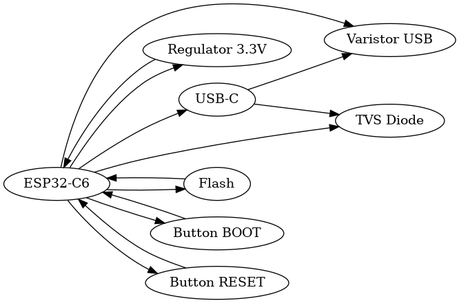

## Functionalitate Hardware

ESP32-C6 este procesorul principal si se ocupa de comunicatie si control. Are Wi-Fi 6 si Bluetooth Low Energy integrate. Toate componentele externe sunt conectate prin magistrale digitale standard pentru a fi usor de extins sau modificat.

- **E-paper Display (SPI):** Ecran cu consum foarte mic, ideal pentru afisarea textului static. Nu consuma curent intre actualizari.
- **BME680 (I2C):** Senzor care masoara temperatura, umiditate, presiune si calitatea aerului.
- **DS3231SN (I2C):** Ceas in timp real (RTC) cu baterie de rezerva. Pastreaza ora corecta chiar si cand dispozitivul este oprit.
- **W25Q512JVEIQ (SPI):** Memorie externa de 64MB pentru stocarea cartilor si a setarilor. Viteza mare de scriere/citire.
- **MAX17048 (I2C):** Monitor de baterie care estimeaza nivelul de incarcare in timp real.
- **Conector QWIIC + Header GPIO:** Permite conectarea de module suplimentare, cum ar fi senzori, ecrane, etc.

## Alimentare si Management Energie

- **Baterie principala:** 3.7V Li-Po, folosita pentru alimentarea intregului dispozitiv.
- **Convertor de tensiune (LDO):** Combinatie intre DMG2305UX (MOSFET pentru control) si XC6220A331MR-G (LDO) – converteste tensiunea bateriei la 3.3V cu un curent maxim de 300 mA.
- **Incarcare baterie:** Se face prin USB-C, folosind circuitul dedicat MCP73831, un incarcator liniar pentru baterii Li-Po.
- **Monitorizare baterie:** Circuitul MAX17048 estimeaza cu precizie nivelul de incarcare al bateriei si trimite informatia catre ESP32-C6 prin I2C.
- **Protectie la descarcari electrostatice (ESD):**
  - La intrarea USB-C este folosit un varistor si o dioda USBLC6-2SC6Y pentru protectie.
  - Liniile SPI (folosite pentru ecran si memorie flash) sunt protejate cu componente dedicate ESD, pentru siguranta la conectarea externa sau descarcari accidentale.

## Conexiuni ESP32-C6

| Functionalitate      | Pin ESP32-C6                          | Descriere                                                                 |
|----------------------|----------------------------------------|---------------------------------------------------------------------------|
| UART pentru debug    | TX / RX                                | Conectat la USB-C pentru programare si comunicatie seriala cu PC-ul      |
| I2C                  | IO4 (SCL), IO5 (SDA)                   | Folosit pentru BME680, DS3231 si conectorul Qwiic                        |
| SPI                  | IO10 (CLK), IO11 (MOSI), IO12 (MISO), IO13 (CS) | Comunica cu memoria flash si ecranul e-paper                      |
| Buton BOOT           | IO9                                    | Buton conectat la linia de BOOT pentru programare                        |
| LED Status           | IO6                                    | LED utilizat pentru semnalizare vizuala (pornit, incarcare, standby etc.)|
| GPIO-uri libere      | IO0, IO1, IO2, IO3                      | Disponibile pentru extensii viitoare                                     |

## Bill of Materials (BOM)

- **BME680**  
  - Link: https://www.snapeda.com/parts/BME680/Bosch/view-part/?welcome=home  
  - Datasheet: https://www.snapeda.com/parts/BME680/Bosch%20Sensortec/datasheet/

- **DMG2305UX-7**  
  - Link: https://componentsearchengine.com/part-view/DMG2305UX-7/Diodes%20Incorporated  
  - Datasheet: https://www.diodes.com//assets/Datasheets/DMG2305UX.pdf

- **W25Q512JVEIQ**  
  - Link: https://www.snapeda.com/parts/W25Q512JVEIQ/Winbond+Electronics/view-part/?ref=eda  
  - Datasheet: https://www.snapeda.com/parts/W25Q512JVEIQ/Winbond%20Electronics/datasheet/

- **MAX17048G+T10**  
  - Link: https://www.snapeda.com/parts/MAX17048G+T10/Analog+Devices/view-part/?ref=eda  
  - Datasheet: https://www.snapeda.com/parts/MAX17048G+T10/Analog%20Devices/datasheet/

- **DS3231SN**  
  - Link: https://www.snapeda.com/parts/DS3231SN%23/Analog+Devices/view-part/?ref=eda  
  - Datasheet: https://www.snapeda.com/parts/DS3231SN%23/Analog%20Devices/datasheet/

- **MCP73831**  
  - Link: https://www.digikey.com/en/models/1874108  
  - Datasheet: —

- **XC6220A331MR-G**  
  - Link: https://componentsearchengine.com/part-view/XC6220A331MR-G/Torex  
  - Datasheet: https://product.torexsemi.com/system/files/series/xc6220.pdf

- **USBLC6-2SC6Y**  
  - Link: https://www.snapeda.com/parts/USBLC6-2SC6Y/STMicroelectronics/view-part/?ref=eda  
  - Datasheet: https://www.snapeda.com/parts/USBLC6-2SC6Y/STMicroelectronics/datasheet/

- **QWIIC PRT-14417**  
  - Link: https://www.snapeda.com/parts/PRT-14417/SparkFun/view-part/  
  - Datasheet: https://www.snapeda.com/parts/PRT-14417/SparkFun%20Electronics/datasheet/

- **ESP32-C6-WROOM-1-N8**  
  - Link: https://www.snapeda.com/parts/ESP32-C6-WROOM-1-N8/Espressif+Systems/view-part/?ref=eda  
  - Datasheet: https://www.snapeda.com/parts/ESP32-C6-WROOM-1-N8/Espressif%20Systems/datasheet/
